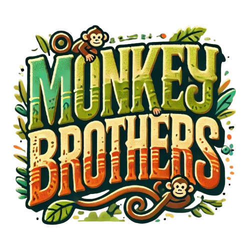

# Monkey Brothers

    

## Contributors
- [Teow Si Hao, Nicholas](https://github.com/nicholasteow)
- [Leroy Teo Jun Yang](https://github.com/leroyteojy)
- [Chong Qi Rong](https://github.com/ChongQiRong)
- [Liu Yan Qin](https://github.com/YanQin-Liu/)
- [Tan Yong Quan](https://github.com/yongggquannn)
- [Javier Ong Ding Quan](https://github.com/jeyvia)

## Content Page
- [Introduction](#introduction)
- [Problem Definition](#problem-definition)
- [Proposed Solution](#proposed-solution)
    - [Inspiration: Fun & Competition](#inspiration-fun--competition)
    - [Why Blockchain & GameFi](#why-blockchain--gamefi)
    - [Gaming as a Social Interaction](#gaming-as-a-social-interaction)
- [Target Users](#target-users)
- [Business Logic](#business-logic)
    - [Marketing Strategies and Player Acquisition](#marketing-strategies-and-player-acquisition)
    - [Revenue](#revenue)
    - [Player Motivation](#player-motivation)
    - [Economic Incentives of the Stakeholders](#economic-incentives-of-the-stakeholders)
    - [Development Plan](#development-plan)
    - [Tokenomics](#tokenomics)
    - [NFT Minting Strategy](#nft-minting-strategy)
- [Gameplay Logic](#gameplay-logic)
    - [Obtaining Monkeys](#obtaining-monkeys)
    - [Game Objective](#game-objective)
    - [Monkeys](#monkeys)
    - [Monkey Stats and Tierlist](#monkey-stats-and-tierlist)
    - [Monkey Typing and ATK Bonuses](#monkey-typing-and-atk-bonuses)
    - [The Home Screen](#the-home-screen)
    - [The Monkey Bazaar](#the-monkey-bazaar)
    - [The Monkey Draw](#the-monkey-draw)
    - [Arena Battle](#arena-battle)
- [Architecture](#architecture)
    - [System Illustration](#system-illustration)
    - [Use case diagram](#use-case-diagram)
    - [User Diagram](#user-diagram)
- [Analysis](#analysis)
    - [Technical Features](#technical-features)
    - [Market Differentiation](#market-differentiation)
    - [Possible Expansion](#possible-expansion)

# Introduction
The project is a GameFi Dapp for a module, IS4302 - Blockchain and Distributed Ledeger Technologies, taken in National University of Singapore (NUS) in 2024.

## Problem Definition
In recent times, the video gaming industry has become one of the biggest and most profitable markets in the world [(Arora, 2023)](https://www.forbes.com/councils/forbesagencycouncil/2023/11/17/the-gaming-industry-a-behemoth-with-unprecedented-global-reach/). With innovation and new genres always around the corner, the market is projected to continue to grow into the future. Another market that has emerged in recent years is the blockchain and cryptocurrency technology. Game Finance (GameFi) is the concept that fuses these markets to create a whole new genre of games, and a new use for blockchain technology. GameFi leverages on decentralised finance (DeFi), to enable players to earn rewards, typically in the form of either cryptocurrency or tokens, through in-game activity [(‌Shin, 2023)](https://www.coindesk.com/learn/what-is-gamefi-and-how-does-it-work/). 

The concept of Play-To-Earn (P2E) has gained traction in both the blockchain and gaming communities, with games like Axie Infinity, The Sandbox and Alien Worlds paving the way for the genre. Unlike traditional games where in-game assets are owned by the game developer, P2E allows players to own in-game items as Non-Fungible Tokens (NFTs). P2E games create opportunities for players to earn rewards through in-game activities. Due to the open economy, players’ activities and demands determine an asset’s value. Players can utilise this open market to profit financially from their in-game activities [(Bodkhe, 2024)](https://sdlccorp.com/post/how-to-transition-from-traditional-games-to-play-to-earn-crypto-games/). 

However, the popularity of P2E games caused the games to be filled with users who are only focused on financial gains to earn a living. Dilution of the genre also caused interests to dwindle amongst the two communities. This is because a majority of these P2E games prioritise passive income and reward incentives, over designing a high-quality gaming experience that brings fun to its users, and invokes competition among players [(Putkaradze, 2023)](https://b2broker.com/news/understanding-gamefi-future-of-the-gaming-landscape/). Consequently, many established games suffer from poor aesthetics and a lack of focus on delivering an enjoyable player experience, prioritising retention strategies over creating a truly engaging and immersive game.

## Proposed Solution
Monkey Brothers is our proposed solution to address the problems identified with the current GameFi genre. Monkey Brothers is a GameFi gaming platform that introduces fun and competition, while allowing players to earn financial rewards through in-game activities. Players will be able to mint ERC-20 tokens, Monks, using ETH, which can be used to mint Monkeys, the game’s form of NFTs. Players will also be able to use Monks to buy, sell and trade Monkeys at The Monkey Bazaar, an open marketplace for Monkeys. Every Monkey has unique attributes like Tier, Typing and Stat values. Players can collect Monkeys and battle other players in the PVP Arena. By winning or drawing the battles, players can earn more Monks and gain Experience Points (XP). 

### Inspiration: Fun & Competition
Monkey Brothers was inspired by popular games such as Pokemon (For Monkeys’ Typings) and Hearthstone (For Monkeys’ Stats & Card designs), an online digital collectible card game based on the lore of the popular franchise, Warcraft. At its core, Monkey Brothers revolves around the premise of different Monkeys. Players can get immersed into a fantasy world of adventure, where they can collect unique Monkeys to strengthen their party, and also feel a sense of accomplishment when they obtain new and rarer Monkeys. The competitive aspect of Monkey Brothers is designed to foster both rivalry and camaraderie among players. The PVP arena allows individuals to challenge each other in strategic battles, driving players to refine their tactics and collect stronger, rarer Monkeys to gain the upper hand. 

### Why Blockchain & GameFi 
When compared to existing digital pet, fighting or even card games, Monkey Brothers provides greater value to its players because it leverages blockchain technology. Blockchain creates value and longevity for the players’ assets. In traditional online games, players never personally owned their assets and any in-game assets or currency belonged solely to the game’s developers. This means that outside of the game, their assets had no real value and would be lost once the game platform shuts down. With the concept of NFTs, players can own in-platform assets on Monkey Brothers, which can also be transferred across different games and platforms on the blockchain. This creates longevity and value for each player’s in-game assets in Monkey Brothers. With an open economy within the game, it allows players to benefit financially through playing the game. Additionally, We chose GameFi due to its rapid growth and promising future in the gaming industry. The global blockchain in gaming market was valued at USD 4.83 billion in 2022 and is projected to expand at a remarkable compound annual growth rate (CAGR) of 68.3% from 2023 to 2030 [(Grand View Research, 2023)](https://www.grandviewresearch.com/industry-analysis/blockchain-gaming-market-report?ref=blog.bake.io). This strong growth trajectory highlights the increasing potential and innovation in the intersection of blockchain technology and gaming, making GameFi an ideal sector to focus on. Furthermore, as seen in Figure 1, the collectible game sector is experiencing significant growth, underscoring its expanding market potential. This increase in demand for blockchain-based digital assets makes it a strategically sound decision to focus on this sector for Monkey Brothers.

    

Figure 1 : GameFi Industry Market Size

### Gaming as a Social Interaction
We believe gaming has a unique ability to bring people together by fostering shared interests and creating meaningful connections. Digital technology has revolutionised how we interact, with gaming emerging as a central part of social life for many. It provides spaces for people to connect, exchange ideas, and strengthen relationships, whether through multiplayer experiences, cooperative gameplay, or even casual discussions about strategies. These interactions are not confined to younger generations; older generations have also embraced gaming as a means of bonding and maintaining relationships.
Research highlights the positive impact of gaming on relationship quality, social support, and overall well-being. Gaming communities form both online and offline, offering players a sense of belonging and shared purpose. Just like other forms of media, gaming acts as a modern "third place" where people can pass time, exchange ideas, and build lasting connections, blending virtual and real-world social interactions seamlessly. With this in mind, we hope Monkey Brothers can become a meaningful part of this evolving social gaming landscape [(Gonçalves, 2023)](https://www.sciencedirect.com/science/article/pii/S0747563223002029).

## Target Users
Our main target users are those who are already in the GameFi and NFT community, who have experienced the novelty of earning through gameplay but are now seeking more meaningful engagement. These players want more than just financial returns—they crave rewarding experiences, mastery, and in-game accomplishments. Monkey Brothers is able to fulfil this need by empowering players with true asset ownership, and at the same time allowing them to enjoy a deeper, more fulfilling GameFi experience that blends fun with financial incentive.

Besides seasoned players, we also aim to attract players from traditional fighting and card games who want to be able to own in-game assets. With minimal barriers to entry, the game requires no background in blockchain or crypto. Players can dive straight into an accessible, play-to-earn experience without technical complications and straightforward game mechanics.

## Business Logic
The game adopts a P2E model, where engaging in the gameplay allows for players to acquire in-game assets and rewards, in which they can gain financial benefits through the game’s open economy. 

### Marketing Strategies and Player Acquisition
To acquire new players from our target demographic, we will employ various marketing strategies such as sponsoring digital influencers and content creators in the gaming, NFT and GameFi genre. Additionally, we will reach out to streamers from major streaming platforms like Twitch to gain pre-access to the game before release and have them live stream Monkey Brothers, creating buzz and increasing hype around the game. We will also utilise social media such as Instagram, Reddit and X, to advertise Monkey Brothers and organise in-game rewards and events for new users, to promote player engagement and growth.

### Revenue 
Monkey Brothers’ revenue comes from platform fees charged on transactions through The Monkey Bazaar and The Monkey Draw. Following the model of other major NFT marketplaces, we plan to implement a 2.5% transaction fee for both buyers and sellers. This fee structure aligns with industry standards, offering a more balanced approach compared to higher fees like those on Axie Infinity, where sellers are charged a 5.25% fee [(Daly, 2024)](https://www.fool.com/money/cryptocurrency/nfts/axie-infinity-marketplace-review/).

### Player Motivation
Monkey Brothers’ business model is centred on monetizing player experiences, while incorporating an element of luck. Players who have devoted more time and effort into playing the game and understanding its mechanics should be the ones who stand to earn the most from playing. With this, we identified 3 key motivators that we can target to maintain player interest and promote long-term engagement:

#### Time and Effort Investment (Skill-Based Progression)
Players are motivated to invest time and effort into understanding the game mechanics and developing strategies. Those who dedicate themselves to learning the game are rewarded by earning more through gameplay, reinforcing the idea that effort leads to success. This creates a sense of accomplishment and progression, where skill and knowledge directly correlate with rewards, keeping committed players engaged.

#### Luck and Excitement (Gacha System)
The inclusion of the gacha system introduces an element of luck, giving all players a chance to earn rewards regardless of their experience level. This system taps into the thrill of randomness and pseudo-gambling, motivating players to keep playing in hopes of obtaining rare or powerful Monkeys. The excitement of the gacha keeps players coming back, as they’re eager to test their luck and see what rewards they might earn.

#### Competition and Social Interaction (PVP Arena and Strategy Development)
The PVP Arena encourages players to compete against one another, which fuels their motivation to develop new strategies and outsmart opponents. As players face off in battles, they become invested in improving their teams and refining their strategies to gain an edge. This competitive aspect fosters a dynamic community where players strive to be the best, sharing strategies, creating “metas,” and pushing each other to progress. The rewards earned from PVP battles further incentivize players to engage and progress, aiming for victory in both gameplay and community recognition.

### Economic Incentives of the Stakeholders
Refer to Table 1 for a detailed breakdown of the benefits for each stakeholder group, which further illustrates how the interests of these parties are intertwined to drive the success of Monkey Brothers.

    

    Table 1

### Development Plan
Monkey Brothers’ development roadmap includes:

1. The initial development of the game, which includes smart contracts, tokenomics and designing of the NFT. This stage is meant to build the foundation of the game and introduce all core functionalities. This is also the current stage of Monkey Brothers.

2. Allow the community to sign up to be Alpha and Beta testers, handing out a limited number of testing keys in each phase. This is to gather user feedback, fix any bugs discovered, and make changes to the game to optimise user experience. This stage is likely to focus on front-end development as we attempt to curate an optimal user experience in Monkey Brothers. 

3. The integration stage for oracles related to NFT minting, minting restrictions and any other ad hoc improvements in tokenomics. This stage aims to properly introduce the gacha system and ensure that the minting process is transparent, and is accurate to the proposed rarity distribution. 

4. More security features should be implemented in this stage to ensure that the minting process is done fairly, and that users are not able to exploit any existing functionalities to gain more rewards. 

5. Launch Monkey Brothers’ officially and launch marketing campaigns to acquire new players. This stage aims to promote Monkey Brothers to our target demographic, using a combination of marketing strategies and in-game events and rewards to attract and establish a strong player base. 

6. Regular updates and improvements, including security patches, Quality of life improvements, in-game events and more. This is meant to continually enhance gameplay experience for all players to keep them engaged and continue to grow Monkey Brothers.

By following this roadmap, we strive to create a sustainable, engaging GameFi platform that allows users to earn financial rewards, while not compromising on the fun and competitive qualities of the game. 

### Tokenomics 
The Monkey Brothers tokenomics model is designed to ensure the sustainability and growth of the game’s ecosystem while addressing potential challenges related to token value and supply. A capped supply of MONKS tokens creates scarcity, driving demand and maintaining token value by preventing excessive inflation and supporting long-term economic stability. However, to further safeguard the ecosystem, we plan to introduce controlled inflation and minting mechanisms. This approach ensures that players can mint MONKS tokens at a gradual, predictable rate rather than minting unlimited amounts. By modelling the minting rate to match the game’s demand growth, we can prevent oversupply while allowing for healthy expansion as the player base grows.

The allocation of tokens reflects a balanced approach to fostering community engagement, supporting development, and securing funding. 35% of the tokens are reserved for Community Rewards, encouraging a loyal and active player base to drive sustainable growth. 25% is allocated to the Development Team to ensure the game’s stability, security, and delivery of a high-quality, player-centric experience. 15% is dedicated to the Token Sale, funding game development, marketing, and infrastructure, while attracting early adopters and boosting visibility. Finally, 10% is allocated to Investors, providing crucial funding and strategic backing to accelerate growth and build a sustainable ecosystem. The remaining tokens are primarily allocated for Marketing and Advertising aimed at promoting the game to a broader audience, enhancing visibility.

This structured and forward-thinking tokenomics model aligns the interests of players, developers, and investors, which we identify as our game’s 3 main stakeholders, and ensures the Monkey Brothers ecosystem remains vibrant, balanced, and poised for long-term success.

    

Figure 2 : Monkey Brothers Token Allocation

### NFT Minting Strategy
Our NFT Minting Strategy is a key component of the Monkey Brothers ecosystem, designed to drive engagement, sustain long-term interest, and increase the value of assets within the game. To achieve this, we will implement limited-time releases of unique Monkey NFTs, each tied to specific themes or in-game events. These themed NFTs will offer players exclusive designs, traits, or abilities that enhance gameplay and make them highly sought after within the community. Refer to Table 2 for some of the possible NFT drops we have planned for Monkey Brothers.

By releasing NFTs in limited batches, we aim to create a sense of urgency and exclusivity, encouraging players to participate actively during release windows. This approach also increases the value of older NFTs over time, as their rarity grows with subsequent releases. The introduction of fresh themes and designs with every new release ensures that the game remains dynamic and appealing to both new and returning players.

To keep the community informed and engaged, all NFT releases will be announced in advance through social media channels, in-game notifications, and our official website. This communication strategy will not only build anticipation but also foster a sense of community among players eagerly awaiting the next release. 

    

    Table 2

## 1.5 Gameplay Logic

### Obtaining Monkeys
New players can purchase a Starter Monkey Pack by exchanging 5 Tokens, which will provide them with the 3 Starter Monkeys. All players who purchase this Starter Monkey Pack will receive 3 Common Tier Monkeys, one of each Type, with unique Attack Values(ATK) and Health Values(HP). Players can obtain other Monkeys through The Monkey Bazaar or The Monkey Draw using Tokens.

### Game Objective
In this game, players engage in Player Versus Player (PVP) battles to earn XP and Monks, with the main objective of building a collection of Monkeys that can generate sustainable income. While increasing their Player Account Level demonstrates competitive progress, the ultimate goal is to grow their collectible assets and create ongoing wealth through the sale and trade of Monkeys, all while enjoying the gameplay experience.

### Monkeys
Each Monkey has a unique combination of Attack Values(ATK), Health Values(HP), Rarity and Type. Both ATK and HP are a range of integer values. There are 4 Rarity tiers in the game: Common, Rare, Epic and Legendary, with Common Monkeys being the weakest, and Legendary Monkeys being the strongest, in terms of ATK and HP values. There are 3 Monkey Types in the game: Grass, Water, Fire, which could affect the damage done from one Monkey to another. Every Monkey minted has a unique ID value, even if they have the same Rarity, Type, ATK and HP Values. 

Figure 3 below illustrates the design elements of a monkey card:
1. Appearance Progression: The monkey cards showcase a visually striking evolution, with the monkey appearing increasingly powerful as it advances through tiers—from a baby monkey to a teenage monkey and finally to a fully grown monkey.

2. Naming Convention: Each monkey is assigned a unique name, combining a descriptor of its elemental type with a specific breed of monkey (e.g., "Flame Howler" or "Aqua Marmoset").

3. Colour Coding: The colour of each card reflects the elemental type of the monkey (e.g., A red frame corresponding to a fire monkey)

4. Stat Boxes: The card features a left box that indicates the monkey's ATK stats, and a right box that indicates the HP stats, providing essential information for gameplay strategy. The two stats always sum to a fixed total.

5. Backstory Description: Each monkey card includes a brief narrative that adds depth to the character, enhancing the gaming experience by providing a backstory that players can connect with, enriching the player's understanding of the monkey's abilities and lore within the game world.

    

  
Figure 3 : Design elements of a monkey card

### Monkey Stats and Tierlist
In the Starter Monkey Pack, each user will receive 3 Common Tier Monkeys, with one of each typing: Grass, Water, and Fire. Each Monkey created in the game is assigned stats based on its rarity, with varying values for ATK and HP. While the individual ATK and HP values may differ within their respective ranges, the two stats must always sum to a fixed total determined by the Monkey's rarity. The specific stat ranges for each rarity tier are detailed in Table 3. 

This approach guarantees that no single Monkey is overwhelmingly powerful or weak, and prevents any one strategy from dominating. Players can encounter Monkeys with higher attack but lower health, or vice versa, depending on how the stats are distributed. This variation promotes strategic decision-making, as players can tailor their choices to fit different playstyles, whether favouring more offensive or defensive Monkeys in battle.

    

Table 3

The starter pack features a vibrant jungle-themed design, surrounded by thick vines and leaves, sitting unopened and waiting to be clicked.

    

  
Figure 4: Starter Pack Design

When the player clicks on the pack, a bright light beam shoots up from the centre, illuminating the jungle background and adding a sense of excitement and anticipation.

    

  
Figure 5 : Pack Opening of a Starter Pack

As the pack opens, the light beam stays brightened, and all three common monkeys of different types are revealed together, glowing as one under the radiant beam, ready to join the player's journey in the game.

    

  
Figure 6 : Starter Monkeys received by player

### Monkey Typing and ATK Bonuses
Each of the 3 Monkey Types are weak to one Type, while being strong against another. When a Monkey’s Type is strong against its Target, it will deal 125% of its ATK value to its target. When a Monkey’s Type is weak against its Target, it will deal 80% of its ATK value to its target. The specific type advantages are labelled in Table 4 below. 

    

    Table 4

Monkey cards can be of different types, each looking visually distinct from one another, from the colour of the card to the symbols that show the monkey’s typings. Figure 7 provides clear visual differentiation between the types and makes it easy to distinguish them at a glance.

    

  
Figure 7: Same Tier Monkeys

In contrast, monkey cards can also be of different tiers within the same type. Higher-tier cards retain the same type-specific design but feature enhanced visuals and better stats, making it easy to identify stronger cards within the same type. The tier of the card is also further specified at the bottom of each card. Figure 8 provides clear visual differentiation between the tiers.

    

  
Figure 8: Same Type Monkeys

### The Home Screen
The Home Screen serves as the central hub of Monkey Brothers, providing quick access to all key sections of the game. Players can view their current MONKS token balance, track their progress through the XP bar, and navigate seamlessly to other game pages. This intuitive design ensures players can manage their in-game resources and progression efficiently while staying engaged in the gameplay experience.

    

  
Figure 9: Home Screen of Monkey Brothers

### The Monkey Bazaar
The Monkey Bazaar is the open marketplace in the game where players can buy and sell Monkeys using Tokens. Players list their Monkeys for sale in exchange for Tokens, with two pricing options:

1. Buy Now Price: A fixed amount of Tokens that allows buyers to instantly purchase the Monkey.

2. Starting Bid Price: A lower price to initiate a 12-hour auction where players can place bids using Tokens. At the end of 12 hours, the highest bidder wins the Monkey. If no bids are placed during the auction period, the Monkey is returned to the seller and will be delisted from the bazaar.

Buyers can either use the Buy Now Price for an immediate purchase or participate in the bidding process. Sellers must set both a Buy Now Price and a Starting Bid Price, with the latter always lower than the former. A filter table is included to allow users to quickly sort through a large number of NFTs to find the one that meets their preferences. Finally, the game will collect a 2% commission fee (in Tokens) from the seller on all successful sales.

The Monkey Bazaar also includes metrics that give insights into the game's economy and the activity of its player base. The metrics are explained as follow:

**Total Volume:** The cumulative trading volume of the NFT collection, measured in Monks. This shows the overall market activity and interest level in the NFTs.

**Floor Price:** The lowest price of any monkey that is currently listed for sale. 

**Best Offer:** The highest offer currently made in the collection.
Percentage Listed: The percentage of the total NFTs that are listed for sale on the marketplace. 

**Unique Owners:** The total number of individual wallets or accounts holding at least one NFT from the collection. 

### The Monkey Draw
The Monkey Draw is a Gacha system where players can obtain new Monkeys. Players purchase Monkey Capsules using Tokens, with a fixed chance (as shown in Table 5) to receive a newly minted Monkey. Each Monkey is randomly assigned a Tier, Type, as well as ATK and HP values. By using a fixed probability for all players to receive higher tier Monkeys, the game introduces an element of fairness. Everyone has an equal chance to obtain powerful Monkeys, regardless of playtime or spending, ensuring that success isn’t exclusively pay-to-win but also accessible through luck. The rarity distribution is also included on the Gacha Mainscreen for players’ reference.

    

Table 5

### Arena Battle

#### Matchmaking and Battle Lineup
Players can participate in a PVP Arena with their Monkeys to earn XP for their accounts. Players would need to admit exactly 3 Monkeys to participate in the Arena, and would be matched with another player with similar XP level. Before entering the Arena, players must decide the order in which they want to send out their Monkeys because the order will be fixed once the Arena battle has started. Once selected, the monkey will be blocked from reselection. If players wish to replace the monkeys, they will do so by tapping on the card to swap out the ones in the lineup.

    

  
Figure 10: Choosing Your Monkeys

#### During Arena Battle 
At the very start of the Arena battle, each player’s first Monkey will be sent out. Each player will attack the opponent’s Monkey simultaneously, with both Monkeys receiving damage based on the opponent’s ATK value and any applicable Type Bonuses. Players will then battle until one of the Monkeys on the field is knocked out. If a player’s Monkey is knocked out, the next Monkey in the party will be sent out to battle.

#### Arena Battle Outcome
A player is the winner of the battle when all of the opponent’s Monkeys have been knocked out, while having at least one surviving Monkey of their own. Winning an Arena battle grants the player a large amount of XP to increase their level and some Monks, while the losing player will receive a much smaller amount of XP for participating. 

If both players happen to knock out the opponent’s Monkeys in the same turn, the Arena Battle will be determined to be a draw. In such an event, both players will receive a moderate amount of XP to increase their level and fewer Monks. 

# Architecture

## System Illustration

    

## Use case diagram

    

## User Diagram

### Battle Arena User Flow

    

### Monkey Bazaar User Flow

    

### Monkey Draw User Flow

    

# Analysis

## Technical Features

## Market Differentiation
### Low Barrier of Entry
Monkey Brothers stands out by offering a low barrier to entry, with minimal upfront investment required and a clean, user-friendly interface that makes gameplay easy to understand and enjoy. Unlike many games that feature complex mechanics and steep learning curves, Monkey Brothers is designed to be accessible to new players, gradually introducing blockchain elements as users become more comfortable with the game. This makes it easier for players to learn at their own pace without feeling overwhelmed (Mangalindan, 2023).

In addition, Monkey Brothers promotes inclusivity by providing low-cost options for players who may not want to invest heavily upfront. Through mechanisms that allow players to earn or receive initial in-game assets without significant financial commitment, Monkey Brothers ensures that financial barriers don't prevent potential players from joining the game and enjoying the experience. This approach sets Monkey Brothers apart by prioritising accessibility, making it easy for anyone to get started and progressively build their in-game assets.

### Quick and Accessible Gameplay
Designed for fast-paced sessions that start and end in minutes, Monkey Brothers makes it ideal for players who want a fun and engaging experience that fits into their busy schedules, allowing them to play anytime, anywhere without committing to lengthy gaming sessions. Imagine a player that is either on a short commute, waiting for an appointment, or taking a quick break at work or school. Monkey Brothers lets players jump into a thrilling battle, strategize, and experience the excitement of gameplay—all in just a few minutes, hassle-free. 

### Gameplay Mechanics
The simultaneous combat mechanic in the Arena Battle system is a key market differentiator for our GameFi project. Unlike traditional turn-based combat, where players alternate attacks, our system allows both players' Monkeys to attack simultaneously. This creates a fast-paced and dynamic battle experience that emphasises strategic planning over reactionary moves. Players must carefully consider their team composition, the order of their Monkeys, and Type Bonuses to outwit their opponents. This innovative approach adds a layer of depth and excitement to gameplay, setting our project apart in a market dominated by predictable and repetitive combat mechanics.

## Possible Expansion

### More Types of Monkeys
We can introduce more Types of Monkeys into the game. This could allow players to mint new Types of Monkeys as the game is updated, where new Types could be introduced through in-game events. This could incentivise players to keep playing Monkey Brothers as there would be new content released consistently. At the same time, new Types would introduce more ATK bonuses, which would stir up the “meta” of PVP battles and allow players to form new strategies.  

### Extension of Gameplay
We can introduce new gameplay mechanics into Monkey Brothers so as to increase the emphasis on skills and reduce the reliance on luck in PVP battles. For example, during a battle, we could allow players to switch to a different Monkey in their party instead of forcing them to attack the opponent’s Monkey every turn. This provides players with more room to strategise, allowing for a greater skill-ceiling in the game and fostering a more competitive environment, enhancing player engagement. 

### Matchmaking Leaderboard
We can introduce a leaderboard based on players’ XP level and Wins, which could encourage players to engage in more PVP battles. Not only does being on the leaderboard give players bragging rights and a sense of accomplishment, but it also presents them with the opportunity to earn seasonal rewards. One possibility would be to reward the top 10 players with Monks and Unique Titles to glorify their achievements. 

### Oracle service for Minting
In the current state of Monkey Brothers, we utilise random number generators in smart contracts to generate each newly minted Monkey’s ATK and HP Values. We can utilise Chainlink’s Verifiable Random Function (VRF) to generate the ATK and HP Values. There are many benefits for doing so, such as offering better security against manipulation. Using Chainlink VRF can also handle multiple requests for randomness generation efficiently, which would allow Monkey Brothers to have better scalability in the long run. 

### Restricting NFT Minting 
Similar to how we maintain the value of Monks, we should also limit the number of Monkeys a player can own or mint. This prevents wealth concentration within Monkey Brothers, and deters individuals from dominating the open market and manipulating the price of Monkeys. This allows Monkeys to be more accessible to the general player base, and enhances the playing experience for all.

### Token Burning Mechanism
As part of our long-term vision for Monkey Brothers, we aim to introduce a token-burning mechanism to enhance the sustainability of the game's economy. One potential approach involves implementing a repair fee for cards that are defeated in battle. This fee would be paid in MONKS tokens and subsequently burned, reducing the total supply over time. Such a mechanism would create a deflationary effect, increasing the token's value while encouraging strategic gameplay and resource management among players. This initiative reflects our commitment to evolving the game’s ecosystem in ways that benefit both players and the overall economy.